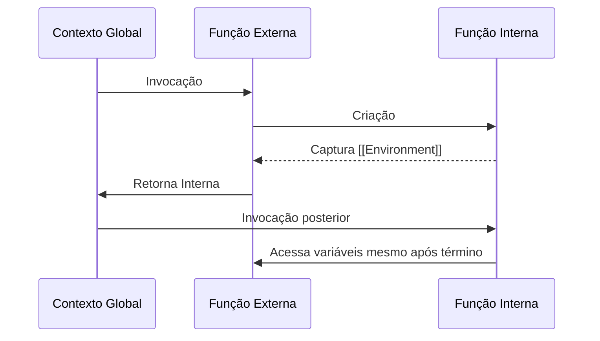
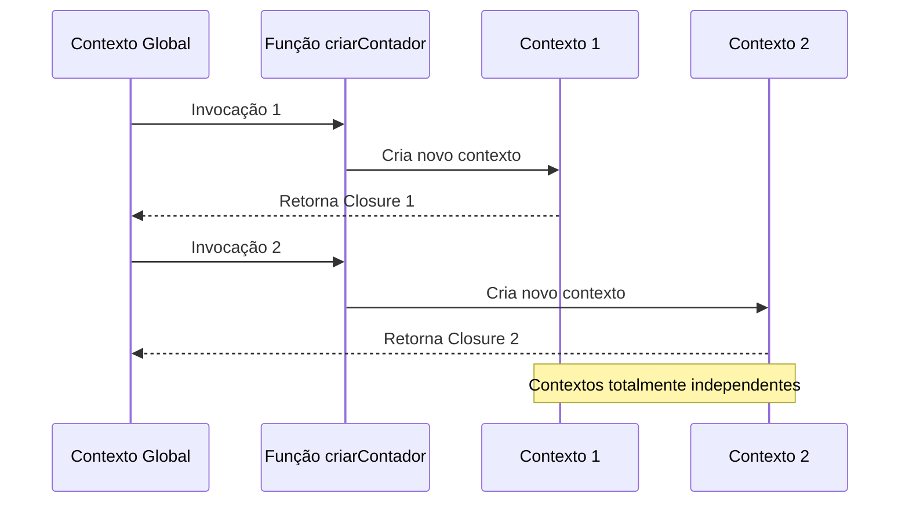

# Closures 

Uma **closure** é a combinação de uma função com seu ambiente léxico - o conjunto de variáveis, parâmetros e funções disponíveis **no momento de sua criação**. Segundo a [MDN](https://developer.mozilla.org/pt-BR/docs/Web/JavaScript/Closures):  

> "Uma closure é a combinação de uma função agrupada com referências ao estado circundante (ambiente léxico). Em outras palavras, uma closure dá acesso ao escopo externo a partir de uma função interna."

**Exemplo**:  
```javascript
function criarContador() {
  let contador = 0; // Variável capturada pela closure
  return function() {
    contador++;
    return contador;
  };
}

const contar = criarContador();
console.log(contar()); // 1
console.log(contar()); // 2 (estado preservado!)
```

## Como funcionam internamente?  

### Contexto de execução e ambiente léxico  

Quando uma função é invocada:  
1. Um **novo contexto de execução** é criado e empurrado para a _call stack_  
2. Seu **registro ambiental** gerencia variáveis locais, parâmetros e referências  
3. Funções internas recebem a propriedade `[[Environment]]`, que referencia o ambiente léxico da função externa  

### Garbage collection e retenção  
- Após a execução, o contexto é **normalmente destruído** pelo _garbage collector_  
- Porém, se uma função interna referencia seu ambiente externo via `[[Environment]]`, esse ambiente **é retido na memória**  



## Isolamento de contexto com closures  
Um dos aspectos mais poderosos das closures é sua capacidade de **isolar completamente estados** entre diferentes invocações da mesma função externa. Cada chamada cria um novo contexto de execução com seu próprio ambiente léxico, resultando em closures totalmente independentes.

### Exemplo detalhado:  
```javascript
function criarContador() {
  // Variável isolada para cada contexto
  let contador = 0;
  
  return {
    incrementar: () => ++contador,
    getValor: () => contador
  };
}

// Criando duas instâncias independentes
const contadorA = criarContador();
const contadorB = criarContador();

contadorA.incrementar();
console.log(contadorA.getValor()); // 1
console.log(contadorB.getValor()); // 0 (totalmente isolado!)

contadorB.incrementar();
contadorB.incrementar();
console.log(contadorB.getValor()); // 2
console.log(contadorA.getValor()); // 1 (não afetado)
```

### Mecanismo de isolamento:  
1. **Primeira invocação** de `criarContador()`:  
   - Cria Contexto de Execução 1  
   - Cria Registro Ambiental 1 com `contador = 0`  
   - Retorna objeto com métodos (Closure 1) vinculados ao Registro 1  

2. **Segunda invocação** de `criarContador()`:  
   - Cria Contexto de Execução 2  
   - Cria Registro Ambiental 2 com `contador = 0`  
   - Retorna objeto com métodos (Closure 2) vinculados ao Registro 2  



## Depuração Prática com [[Scopes]] no Chrome

### Acessando a Cadeia de Escopos
O Chrome DevTools revela a propriedade interna `[[Scopes]]` que mostra a hierarquia completa de ambientes léxicos retidos por uma closure:

1. **Exemplo**:
```javascript
function criarContador() {
  let contador = 0;
  
  return function() {
    contador++;
    debugger; // Ponto de depuração
    return contador;
  };
}

const contar = criarContador();
contar(); // Executa até o breakpoint
```

2. **Passo a passo de inspeção**:
   1. Abra o Chrome DevTools (F12)
   2. Cole o código no console e execute
   3. O código pausará na declaração `debugger`
   4. No painel **Sources**, observe o painel **Scope** à direita

### Estrutura do [[Scopes]]
No painel Scope, você verá:

```
Scope (local)
  ▶ Closure (criarContador)
    contador: 1
  ▶ Script
  ▶ Global
```

- **Closure (criarContador)**: Ambiente da função externa retido
  - Mostra a variável `contador` com valor atualizado
- **Script**: Escopo do script atual (em módulos)
- **Global**: Objeto global (window no navegador)

### Evolução Histórica
- **Versões antigas (< Chrome 80)**: Exibiam `[[Scopes]]` diretamente nas propriedades da função
- **Versões modernas**: Organizam a informação no painel Scope


## Bibliotecas e frameworks que utilizam closures intensivamente

### 1. React (Hooks)  
**Mecanismo**: `useState`, `useEffect` e hooks personalizados usam closures para isolar estados entre componentes.  

```javascript
function Counter() {
  const [count, setCount] = useState(0); // Closure captura 'count'
  useEffect(() => {
    const timer = setInterval(() => setCount(c => c + 1), 1000);
    return () => clearInterval(timer); // Cleanup via closure
  }, []);
  return <div>{count}</div>;
} 
```  
*O estado `count` é mantido entre re-renderizações graças à closure criada pelo hook* .

### 2. Redux
**Mecanismo**: A função `createStore` usa closures para gerenciar estado global e listeners.  

```javascript
function createStore(reducer) {
  let state;
  const listeners = [];

  return {
    getState: () => state, // Closure sobre 'state'
    dispatch: (action) => {
      state = reducer(state, action);
      listeners.forEach(listener => listener());
    },
    subscribe: (listener) => {
      listeners.push(listener);
      return () => listeners.splice(listeners.indexOf(listener), 1);
    }
  };
}
```  
*Estado e listeners são encapsulados via closure* .

### 3. Lodash
**Mecanismo**: Funções utilitárias como `_.memoize` e `_.curry` usam closures para cache e composição.  

```javascript
const memoizedFib = _.memoize(n => 
  n <= 1 ? n : memoizedFib(n - 1) + memoizedFib(n - 2)
);
```  
*Closure retém o cache de resultados para otimização*.

### 4. Express.js  
**Mecanismo**: Middlewares usam closures para acessar objetos `req`, `res` e compartilhar contexto.  

```javascript
app.use((req, res, next) => {
  const startTime = Date.now(); // Capturado pela closure
  res.on("finish", () => console.log(`Tempo: ${Date.now() - startTime}ms`));
  next();
});
```  
*Closure preserva `startTime` entre eventos assíncronos* .


## Casos de uso reais  

### 1. Dados privados (encapsulamento)  
```javascript
function criarBanco() {
  let saldo = 0; // Privado!
  return {
    depositar: valor => saldo += valor,
    sacar: valor => saldo >= valor ? (saldo -= valor) : "Saldo insuficiente",
    verSaldo: () => `R$${saldo.toFixed(2)}`
  };
}

const conta = criarBanco();
conta.depositar(1000);
conta.sacar(300);
console.log(conta.verSaldo()); // R$700.00
// Não há acesso direto à variável 'saldo'
```

### 2. Funções de fábrica com estado isolado  
```javascript
function criarLogger(prefijo) {
  let contador = 0; // Estado isolado por instância
  
  return function(mensagem) {
    contador++;
    console.log(`[${prefijo}:${contador}] ${mensagem}`);
  };
}

const logA = criarLogger("SISTEMA-A");
const logB = criarLogger("SISTEMA-B");

logA("Iniciado"); // [SISTEMA-A:1] Iniciado
logB("Processando"); // [SISTEMA-B:1] Processando
logA("Finalizado"); // [SISTEMA-A:2] Finalizado
```

### 3. Memoização com cache isolado  
```javascript
function criarMemoizador() {
  const cache = new Map(); // Cache isolado por instância
  
  return function(fn) {
    return (...args) => {
      const chave = JSON.stringify(args);
      if (cache.has(chave)) return cache.get(chave);
      
      const resultado = fn(...args);
      cache.set(chave, resultado);
      return resultado;
    };
  };
}

// Dois memoizadores independentes
const memoizadorA = criarMemoizador();
const memoizadorB = criarMemoizador();

const fibA = memoizadorA(n => n <= 1 ? n : fibA(n-1) + fibA(n-2));
const fibB = memoizadorB(n => n * 2); // Função diferente

console.log(fibA(10)); // 55 (usa cache próprio)
console.log(fibB(10)); // 20 (cache separado)
```

### 4. Componentes UI com estado isolado  
```javascript
function criarContadorUI(rotulo) {
  let contagem = 0;
  const container = document.createElement('div');
  
  const atualizarUI = () => {
    container.innerHTML = `
      <h3>${rotulo}: ${contagem}</h3>
      <button class="incrementar">+</button>
    `;
    container.querySelector('.incrementar').addEventListener('click', () => {
      contagem++;
      atualizarUI();
    });
  };
  
  atualizarUI();
  return container;
}

// Dois contadores independentes na mesma página
document.body.appendChild(criarContadorUI("Contador 1"));
document.body.appendChild(criarContadorUI("Contador 2"));
```

## Armadilhas comuns e soluções  

### 1. Loops e Closures  
**Problema histórico com `var`**:  
```javascript
for (var i = 0; i < 5; i++) {
  setTimeout(() => console.log(i), 100); // Imprime 5, 5, 5, 5, 5!
}
```

**Soluções**:  
```javascript
// Com let (escopo de bloco)
for (let i = 0; i < 5; i++) {
  setTimeout(() => console.log(i), 100); // 0,1,2,3,4
}

// Com IIFE (Immediately Invoked Function Expression)
for (var i = 0; i < 5; i++) {
  (function(j) {
    setTimeout(() => console.log(j), 100); // 0,1,2,3,4
  })(i);
}
```

### 2. Vazamento de memória  
**Retenção acidental de dados grandes**:  
```javascript
function processarDataset() {
  const dataset = carregarDadosMassivos(); // 500MB+
  return function(itemId) {
    return dataset.find(item => item.id === itemId);
  };
}
// Mesmo acessando 1 item, todo dataset fica na memória!
```

**Solução com carregamento sob demanda**:  
```javascript
function criarAcessoDataset() {
  let dataset; // Não carrega imediatamente
  
  return {
    getItem: (id) => {
      dataset = dataset || carregarDados(); // Carrega sob demanda
      return dataset.find(item => item.id === id);
    },
    clearCache: () => dataset = null // Liberação explícita
  };
}
```

### 3. Compartilhamento indevido de ambiente  
**Problema**:  
```javascript
const recursoCompartilhado = {};

function criarServico() {
  return {
    usarRecurso: () => {
      recursoCompartilhado.value = Math.random(); 
      // Todas instâncias compartilham mesmo recurso!
    }
  };
}
```

**Solução com isolamento**:  
```javascript
function criarServico() {
  const recursoPrivado = {}; // Isolado por closure
  
  return {
    usarRecurso: () => {
      recursoPrivado.value = Math.random();
      // Cada instância tem seu próprio recurso
    }
  };
}
```

## Boas práticas

1. **Libere recursos explicitamente**:  
   ```javascript
   function criarRecurso() {
     const dados = new Array(1000000);
     
     return {
       usar: () => processar(dados),
       liberar: () => dados = null // Ajuda GC
     };
   }
   ```

2. **Evite aninhamento profundo**:  
   ```javascript
   // Ruim: Múltiplos níveis de closure
   function externa() {
     const a = 1;
     function media() {
       const b = 2;
       function interna() {
         const c = 3;
         return a + b + c;
       }
       return interna;
     }
     return media;
   }
   ```

3. **Use módulos para organização**:  
   ```javascript
   // moduloContador.js
   let contador = 0;
   
   export function incrementar() {
     contador++;
   }
   
   export function getValor() {
     return contador;
   }
   ```

## Recursos avançados  
- [Análise de memória com DevTools](https://developer.chrome.com/docs/devtools/memory-problems/)  
- [Padrões de projeto com closures](https://addyosmani.com/resources/essentialjsdesignpatterns/book/#modulepatternjavascript)  
- [Closures em loops modernos](https://dmitripavlutin.com/javascript-closures-inside-loops/)

## Referências Utilizadas
- [JavaScript Visualized - Closures](https://www.youtube.com/watch?v=6Ixyltr8_R0) 
- [avaScript Closures Tutorial (Explained in depth)](https://www.youtube.com/watch?v=aHrvi2zTlaU) 
- [JavaScript Function Closures (Codeguage)](https://www.codeguage.com/v1/courses/js/functions-closures#Deprecated_notice)
- [MDN Web Docs - Closures](https://developer.mozilla.org/pt-BR/docs/Web/JavaScript/Closures)
- [JavaScript.info - Closures](https://javascript.info/closure)
- [You Don't Know JS: Scope & Closures](https://github.com/cezaraugusto/You-Dont-Know-JS/blob/portuguese-translation/scope%20%26%20closures/ch5.md)
- [Eloquent JavaScript](https://eloquentjavascript.net/)