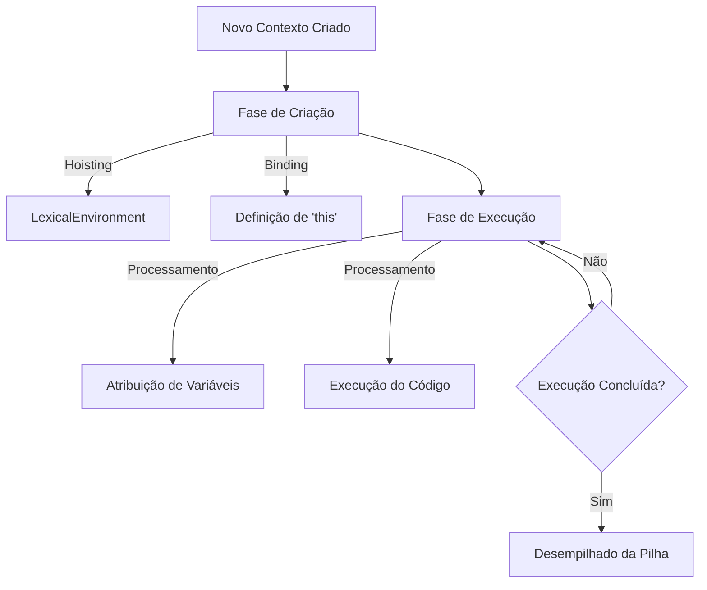
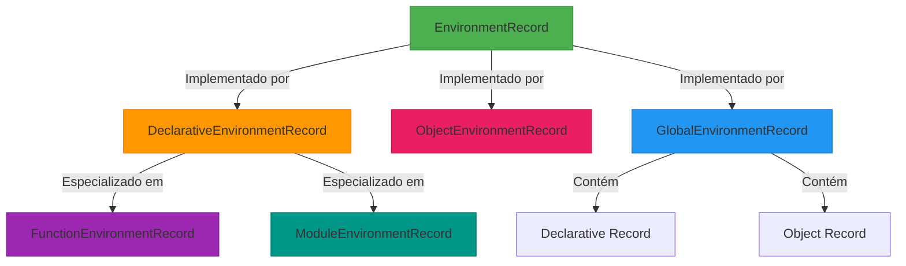
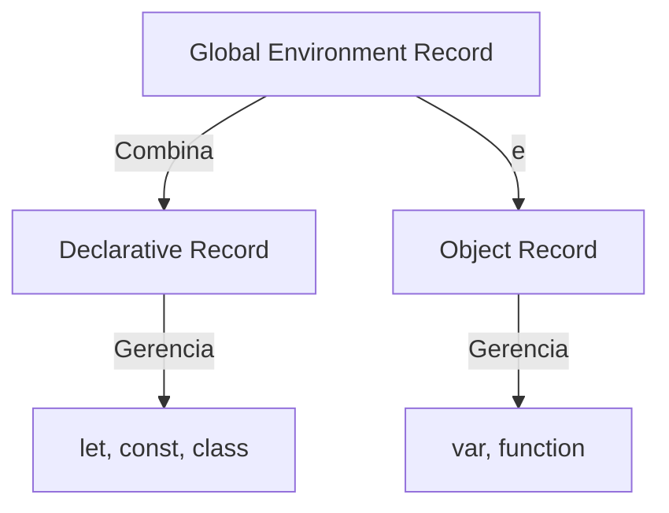
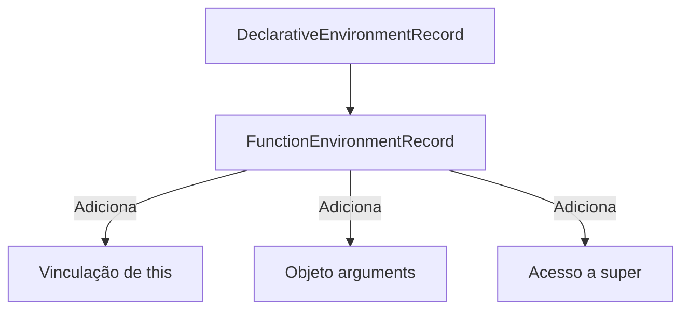
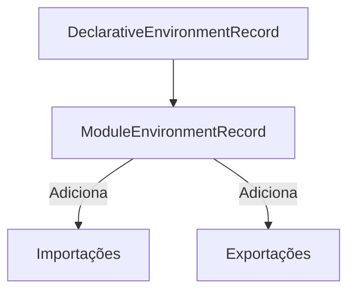
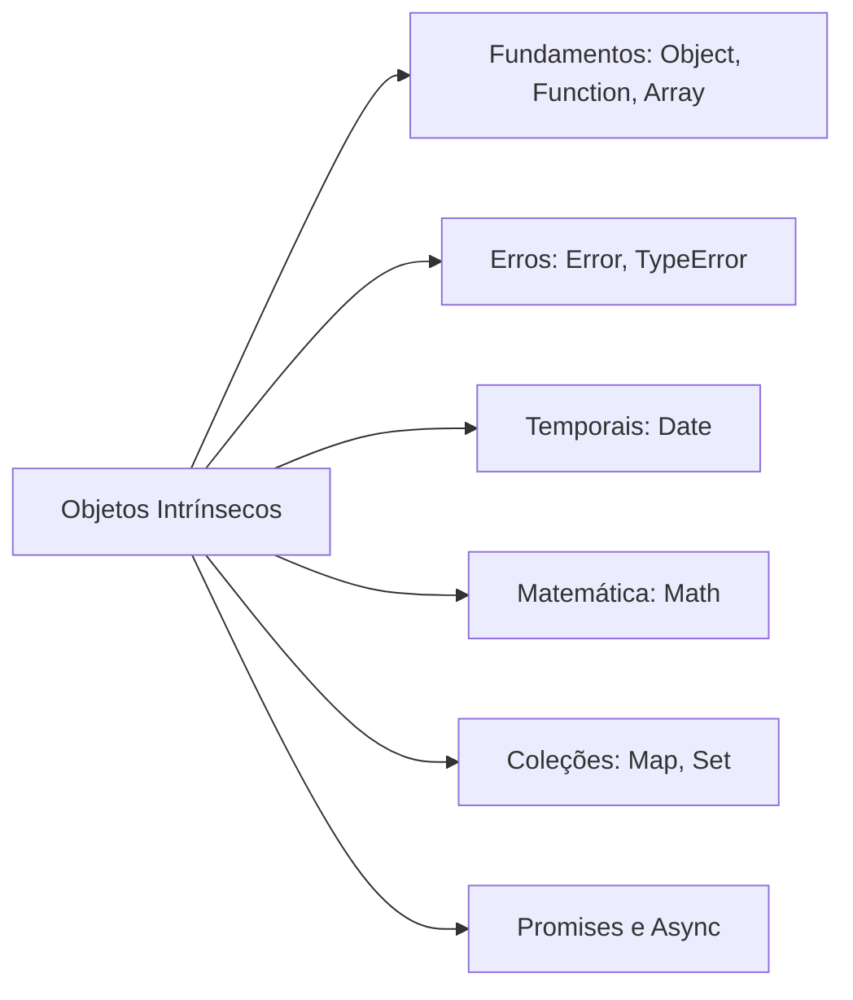
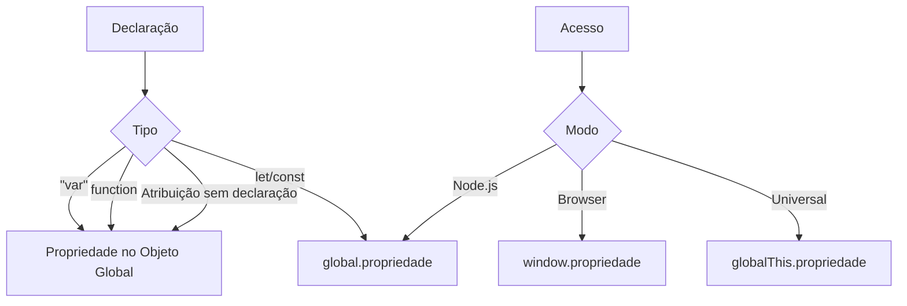
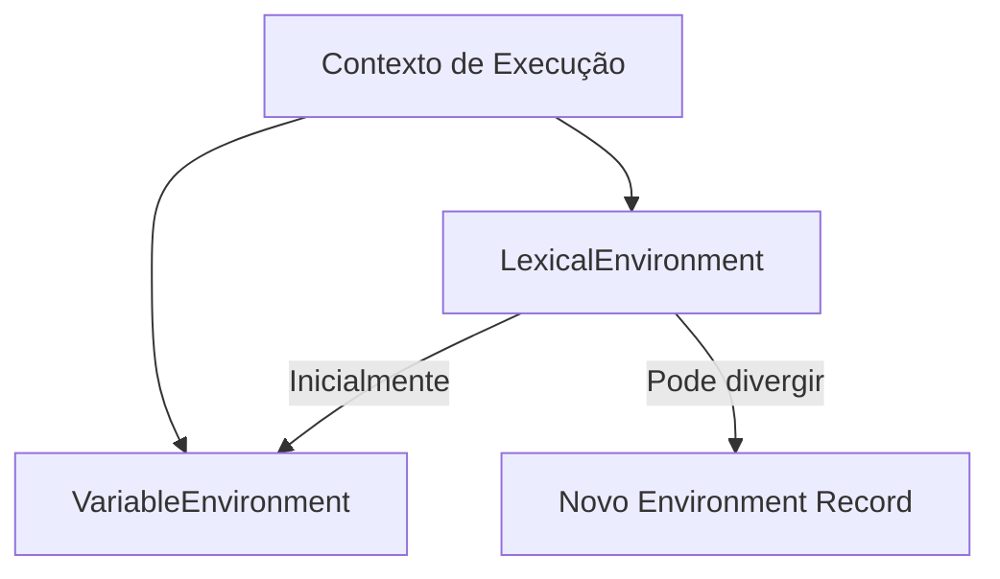
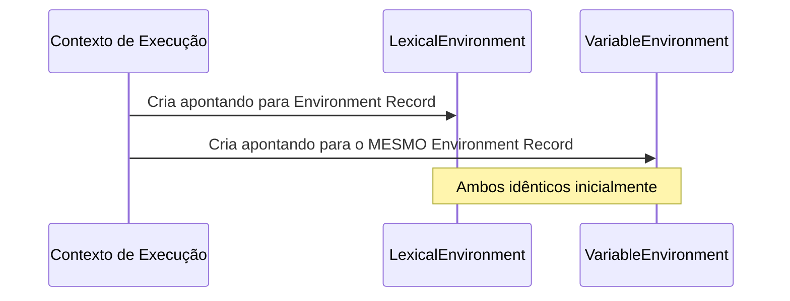
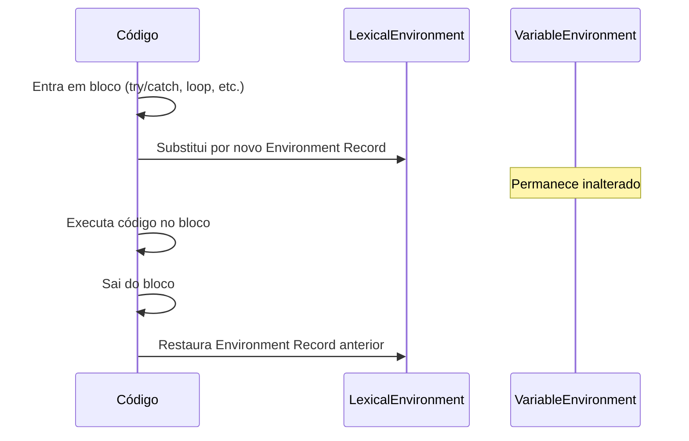

# Contexto de Execução 

## Definição e funcionamento

Um **contexto de execução** é uma estrutura abstrata criada pelo motor JavaScript para gerenciar a execução de código. Sempre que qualquer código é executado em um destes ambientes:
- **Global** (script principal)
- **Função** (invocação de função)
- **Módulo** (código modular ES6+)
- **Eval** (execução dinâmica via `eval()`)

um novo contexto é criado. Este contexto é responsável por:

1. Rastrear o ambiente de execução atual
2. Gerenciar variáveis e declarações
3. Controlar o fluxo de execução do código


Os contextos são organizados em uma **pilha de execução (call stack)** seguindo o princípio **LIFO** (Last In, First Out - Último a Entrar, Primeiro a Sair). O contexto no topo da pilha é sempre o ativamente em execução. Quando sua execução termina, ele é removido da pilha e o controle retorna ao contexto anterior.

Cada contexto de execução passa por **duas fases distintas**:
1. **Fase de Criação (Creation Phase)**  

   Ocorre **antes** da execução do código:
   - **Ambiente Léxico (LexicalEnvironment)** é criado:
     - `EnvironmentRecord`: Registra variáveis, funções e parâmetros (hoisting)
     - `outer`: Referência ao escopo externo (cadeia de escopos)
   - **Ambiente de Variáveis (VariableEnvironment)** é inicializado (em contextos não-modernos, é separado, mas no ES6+ é equivalente ao LexicalEnvironment para `var`):
     - Declarações `var` são registradas como `undefined`
     - Declarações `function` são completamente inicializadas
   - **`this`** é vinculado ao contexto
   - **Escopos de bloco** (`let`/`const`) são criados (mas não inicializados, entrando em TDZ - Temporal Dead Zone)

2. **Fase de execução (execution phase)**  

   O código é processado linha a linha:

   - Atribuições de valores a variáveis
   - Execução de expressões e chamadas de função
   - Resolução de referências a variáveis
   - Inicialização de `let`/`const` (fim da TDZ - Temporal Dead Zone)


#### Exemplo prático: Entendendo as fases

```javascript
console.log(a); // undefined (hoisting)
var a = 10;
function foo(b) {
  console.log(c); // ReferenceError (TDZ)
  let c = 20;
  console.log(b);
}
foo(a);
```
Passo a passo:
1. **Contexto Global - Fase de Criação**:
   - `a` (var) é registrada no ambiente léxico como `undefined`.
   - `foo` é registrada como uma função (hoisting total).
   - `this` é vinculado ao objeto global (no navegador, `window`).
2. **Contexto Global - Fase de Execução**:
   - `console.log(a)`: imprime `undefined` (valor de `a` na fase de criação).
   - `a = 10`: atribui o valor 10 à variável `a`.
   - `foo(a)`: invoca a função `foo` com o argumento 10 (valor de `a`). 
   - **Cria um novo contexto de execução para `foo`**.
3. **Contexto de `foo` - Fase de Criação**:
   - Parâmetro `b` é registrado com o valor passado (10).
   - `c` (declarada com `let`) é registrada, mas **não inicializada** (entra em TDZ).
4. **Contexto de `foo` - Fase de Execução**:
   - `console.log(c)`: tenta acessar `c` que está em TDZ → lança `ReferenceError`.
   - A execução é interrompida. Se não houvesse erro, as próximas linhas seriam:
     - `c = 20`: inicializa `c` (fim da TDZ).
     - `console.log(b)`: imprime 10.
> **TDZ (Temporal Dead Zone)**: Período entre a criação do escopo (fase de criação) e a inicialização da variável (fase de execução) onde o acesso a `let`/`const` gera `ReferenceError`.

---
## Registros de ambiente

### Environment Records: O sistema de mapeamento

Os **Environment Records** são estruturas internas definidas pela especificação ECMAScript que:

- **Mapeiam identificadores** (nomes de variáveis/funções) para seus valores
- **Gerenciam associações** entre nomes e valores durante a execução
- **Implementam regras** de escopo léxico e acesso a variáveis



### Global Environment Record: O gerenciador híbrido

O **Global Environment Record** gerencia o escopo global usando dois componentes distintos:



### Declarative Environment Record (componente global)
Gerencia declarações modernas no escopo global:

**Características**:
- Armazena `let`, `const` e `class`
- Não cria propriedades no objeto global
- Implementa Temporal Dead Zone (TDZ)
- `OuterEnv = null` (fim da cadeia de escopos)

```javascript
let globalLet = "valor";
const GLOBAL_CONST = 10;
class MinhaClasse {}

console.log(globalThis.globalLet); // undefined
console.log(globalThis.MinhaClasse); // undefined
```

### FunctionEnvironmentRecord: Ambiente para funções

O **FunctionEnvironmentRecord** é uma especialização do DeclarativeEnvironmentRecord que adiciona capacidades para funções:



#### Funcionalidades essenciais
1. **Vinculação de `this`**:
   ```javascript
   function normalFunc() {
     console.log(this); // Dinâmico (depende da chamada)
   }
   
   const arrowFunc = () => {
     console.log(this); // Léxico (escopo externo)
   };
   ```

2. **Objeto `arguments`**:
   ```javascript
   function soma(a, b) {
     console.log(arguments[0]); // 5 (apenas funções não-arrow)
   }
   soma(5, 10);
   ```

3. **Acesso a `super`**:
   ```javascript
   class Pai {
     metodo() { return "Pai"; }
   }
   
   class Filho extends Pai {
     metodo() {
       return super.metodo() + " > Filho";
     }
   }
   ```

#### Exemplo completo
```javascript
function criarContador(inicial) {
    // Variáveis gerenciadas pelo FunctionEnvironmentRecord
    let contador = inicial;
    
    return {
        incrementar: () => contador++,
        valor: () => contador,
        // 'this' é acessível
        reset: function() { 
            this.contador = inicial; 
        }
    };
}
```

### ModuleEnvironmentRecord: Ambiente para módulos ES6

O **ModuleEnvironmentRecord** estende o DeclarativeEnvironmentRecord com:



#### Funcionalidades principais
1. **Importações imutáveis**:
   ```javascript
   import { API_KEY } from './config.js';
   API_KEY = "novo"; // TypeError: Assignment to constant
   ```

2. **Ligações indiretas**:
   ```javascript
   // contador.js
   export let contador = 0;
   
   // main.js
   import { contador } from './contador.js';
   contador++; // Atualiza a ligação original
   ```

3. **Resolução estática**:
   ```javascript
   // Válido (top-level)
   import { func } from './modulo.js';
   
   // Inválido (condicional)
   if (condicao) {
     import { func } from './modulo.js'; // SyntaxError
   }
   ```

#### Exemplo completo
```javascript
// math.js (módulo)
export const PI = 3.14159;

export function soma(a, b) {
    return a + b;
}

// app.js (importador)
import { PI, soma } from './math.js';

console.log(soma(PI, 10)); // 13.14159
```

### Object Environment Record (componente global)
Gerencia declarações tradicionais no escopo global:

**Características**:
- Armazena `var` e funções declaradas
- Vincula diretamente ao objeto global (`window`/`globalThis`)
- `OuterEnv = null`
- Declarações tornam-se propriedades do objeto global

```javascript
var globalVar = "valor";
function globalFunc() {}

console.log(globalThis.globalVar); // "valor"
console.log(globalThis.globalFunc); // function
```
 
### Tabela comparativa: Tipos de registros

| Registro                     | Propósito Principal            | Exemplo de Uso                 | Característica Única               |
|------------------------------|--------------------------------|--------------------------------|------------------------------------|
| **GlobalEnvironmentRecord**  | Escopo global                  | Scripts tradicionais           | Combina dois registros             |
| **DeclarativeEnvironmentRecord** | Escopos de bloco            | `{}`, `if`, `for`             | Gerencia `let`/`const` com TDZ     |
| **FunctionEnvironmentRecord** | Funções e métodos             | `function(){}`, `() => {}`     | Gerencia `this`, `arguments`       |
| **ModuleEnvironmentRecord**  | Módulos ES6                   | `import`/`export`              | Ligações imutáveis para imports    |
| **ObjectEnvironmentRecord**  | Vinculação a objetos          | Contexto global, `with`        | Acesso direto a propriedades       |

---

## OuterEnv: O Coração das closures

### Mecanismo fundamental
Todo registro de ambiente possui um campo **`OuterEnv`** que referencia seu ambiente pai, formando a **cadeia de escopos** (scope chain). 

**Processo de resolução de identificadores**:
1. Busca começa no registro atual
2. Se não encontrado, segue a referência `OuterEnv`
3. Repete até encontrar o identificador ou chegar ao escopo global (`OuterEnv = null`)
4. Identificador inexistente resulta em `ReferenceError`

```javascript
function externo() {
    const externoVar = 10; // No registro de 'externo'
    
    function interno() {
        // Pode acessar externoVar via OuterEnv
        console.log(externoVar);
    }
    
    return interno;
}

const closure = externo();
closure(); // Mantém acesso ao OuterEnv mesmo após execução
```

## Componentes do Contexto Global

### Estado de avaliação de código
Mecanismo que mantém o estado de execução para recursos complexos:

| Recurso                | Funcionalidade                  | Exemplo Prático               |
|------------------------|--------------------------------|-------------------------------|
| **Async/Await**        | Suspensão e retomada de contexto| `async function fetchData()`  |
| **Geradores**          | Controle de estado entre yield  | `function* generator()`      |
| **Depuração**          | Gerenciamento de breakpoints    | Pausa no DevTools            |
| **Tratamento de Erros**| Rastreamento da pilha de chamadas| `new Error().stack`          |

### Realm: Domínio de execução isolado

#### Conceito fundamental
Um **Realm** é um ambiente de execução completamente isolado que funciona como um "container" independente para código JavaScript. Este mecanismo garante:

1. **Isolamento total**: Código em diferentes Realms não interfere entre si
2. **Segurança**: Previne acesso não autorizado entre contextos
3. **Estabilidade**: Falhas em um Realm não afetam outros

**Exemplo prático**: Quando você abre uma nova aba no navegador, um novo Realm é criado automaticamente. Isso significa que:

```javascript
// Tab 1 (www.site-a.com)
window.appData = { usuario: "João" };

// Tab 2 (www.site-b.com)
console.log(window.appData); // undefined - Realms diferentes!
```

#### Componentes essenciais
Cada Realm possui três elementos fundamentais:

#### Objetos intrínsecos (intrinsics)
São as implementações padrão das funcionalidades básicas da linguagem:



**Características principais**:
- São criados antes da execução de qualquer código
- Implementações independentes por Realm
- Acessíveis via objeto global (ex: `window.Array`)

#### Objeto Global

O **Objeto Global** é uma instância fundamental que serve como ponto de acesso principal dentro de um Realm. Mais do que um simples "objeto literal", ele funciona como:

1. **Container raiz** para todas as variáveis globais
2. **Ponto de entrada** para funcionalidades do ambiente
3. **Interface universal** entre JavaScript e o ambiente host

**Implementações por ambiente**:
| Ambiente       | Objeto Global | Acesso Universal       |
|----------------|---------------|------------------------|
| Navegador      | `window`      | `globalThis`           |
| Node.js        | `global`      | `globalThis`           |
| Web Workers    | `self`        | `globalThis`           |
| Deno           | `globalThis`  | `globalThis`           |
| Módulos ES6    | `<module>`    | `globalThis`           |

> **Nota**: `globalThis` (ES2020) é o padrão cross-platform para acesso seguro ao objeto global em qualquer ambiente.

#### Anatomia do Objeto Global

##### Propriedades de especificação (intrinsic properties)
São os objetos e funções definidos pelo **padrão ECMAScript** que formam o núcleo da linguagem:

```javascript
// Exemplos fundamentais
globalThis.Array    // Construtor de arrays
globalThis.Date     // Manipulação de datas
globalThis.JSON     // Serialização de objetos
globalThis.Math     // Operações matemáticas
globalThis.SyntaxError // Construtor de erros
```

**Características principais**:
- Implementadas diretamente pelo motor JavaScript
- Seguem rigorosamente a especificação ECMAScript
- Não podem ser deletadas ou reconfiguradas
- São idênticas em conceito entre ambientes (mas implementações podem variar)

##### Propriedades do host (Host-Defined Properties)
Funcionalidades específicas do **ambiente de execução**:

```javascript
// Navegador
globalThis.document     // Árvore DOM completa
globalThis.location     // Informações de URL
globalThis.history      // Navegação entre páginas
globalThis.fetch        // API de requisições HTTP
globalThis.localStorage // Armazenamento persistente

// Node.js
globalThis.process      // Informações do processo
globalThis.__filename   // Caminho do arquivo atual
globalThis.Buffer       // Manipulação de binários
globalThis.require      // Sistema de módulos
```

**Comportamento importante**:
- Não padronizadas pela ECMAScript
- Podem variar significativamente entre ambientes
- Normalmente são somente-leitura
- Refletem capacidades específicas da plataforma

##### Propriedades do usuário (User-Defined Properties)
Variáveis e funções adicionadas por **desenvolvedores**:

**Adição explícita** (recomendada):
```javascript
// Definição direta
globalThis.appConfig = {
  environment: 'production',
  version: '2.3.0',
  apiUrl: 'https://api.meudominio.com'
};

// Acesso em qualquer escopo
function fetchData() {
  return fetch(globalThis.appConfig.apiUrl);
}
```

**Adição implícita** (Através de declarações globais):
```javascript
// Variável 'var' torna-se propriedade
var globalCounter = 0; 
console.log(globalThis.globalCounter); // 0

// Funções declaradas
function formatCurrency(value) {
  return `R$ ${value.toFixed(2)}`;
}
globalThis.formatCurrency(199.9); // "R$ 199.90"

// Perigo: atribuição sem declaração
globalVariable = 10; // Cria propriedade no objeto global!
console.log(globalThis.globalVariable); // 10
```

#### Mecanismos de adição: Explicação técnica



#### Tabela comparativa de comportamento

| Tipo de Declaração | Torna-se Propriedade | Escopo        | Hoisting | Pode ser Deletada? |
|--------------------|----------------------|---------------|----------|-------------------|
| **var**            | Sim                  | Função/Global | Sim      | Não               |
| **function**       | Sim                  | Global        | Sim      | Não               |
| **let/const**      | Não                  | Bloco         | Parcial  | -                 |
| **Atribuição direta** | Sim               | Global        | Não      | Sim               |

### Ambientes léxico e de variáveis: Os dois pilares da execução

Todo contexto de execução em JavaScript possui **dois componentes ambientais** que trabalham em conjunto para gerenciar variáveis e declarações:



### LexicalEnvironment: O Ambiente dinâmico

O **LexicalEnvironment** é o componente que:

1. **Aponta para** o Environment Record atual do contexto
2. **Gerencia** declarações com escopo léxico preciso
3. **Muda dinamicamente** durante a execução

##### Conteúdo e comportamento
| Tipo de Declaração      | Comportamento                   | Exemplo                  |
|-------------------------|--------------------------------|--------------------------|
| **`let`**               | Escopo de bloco, sujeito a TDZ  | `let x = 10;`           |
| **`const`**             | Escopo de bloco, imutável       | `const PI = 3.14;`      |
| **Classes**             | Escopo de bloco, hoisted parcial| `class MinhaClasse {}`  |
| **Módulos (import/export)**| Escopo de módulo             | `import { x } from 'mod'` |
| **Parâmetros de função**| Escopo de função               | `function(a, b) {}`     |

**Características principais**:
- **Temporal Dead Zone (TDZ)**: Acesso antes da declaração causa erro
  ```javascript
  console.log(a); // ReferenceError
  let a = 10;
  ```
- **Mutabilidade**: Pode ser substituído durante a execução
  ```javascript
  function exemplo() {
    // Ambiente léxico inicial
    
    {
      // Novo ambiente léxico criado para o bloco
      let x = 20;
    }
  }
  ```
- **Sombreamento (Shadowing)**:
  ```javascript
  let x = "global";
  
  {
    let x = "bloco"; // Sombreia a variável externa
    console.log(x); // "bloco"
  }
  
  console.log(x); // "global"
  ```

### VariableEnvironment: O Ambiente estático

O **VariableEnvironment** é o componente que:
1. **Aponta permanentemente** para o Environment Record inicial
2. **Gerencia** declarações tradicionais com hoisting
3. **Permanece imutável** durante toda a execução

#### Conteúdo e comportamento
| Tipo de Declaração      | Comportamento                   | Exemplo                  |
|-------------------------|--------------------------------|--------------------------|
| **`var`**               | Escopo de função/global        | `var y = 20;`           |
| **Funções declaradas**  | Hoisting completo               | `function z() {}`       |
| **Funções async**       | Hoisting completo               | `async function w() {}` |

**Características principais**:
- **Hoisting Completo**: Declarações são movidas para o topo do escopo
  ```javascript
  console.log(b); // undefined (não erro!)
  var b = 10;
  ```
- **Imutabilidade**: Mantém a mesma referência durante toda execução
  ```javascript
  function exemplo() {
    var c = 10;
    
    {
      // Mesmo VariableEnvironment!
      var c = 20; 
    }
    
    console.log(c); // 20
  }
  ```
- **Sem TDZ**: Variáveis são inicializadas com `undefined`
  ```javascript
  console.log(d); // undefined
  var d = 30;
  ```

### Relação entre LexicalEnvironment e VariableEnvironment

### Fase de criação do contexto


### Durante a execução


### Casos especiais e comportamentos críticos

### 1. Blocos `try/catch`
```javascript
let externo = "valor";

try {
    throw new Error();
} catch (erro) { // Novo LexicalEnvironment criado
    let interno = "bloco";
    var vazando = "vaza"; // VariableEnvironment (escopo externo)
    
    console.log(erro.message); // Acessível
}

console.log(vazando); // "vaza" (var vaza)
console.log(erro);    // ReferenceError (erro não acessível)
console.log(interno); // ReferenceError
```

### 2. Loops com `let` vs `var`
```javascript
// Com let (novo LexicalEnvironment por iteração)
for (let i = 0; i < 3; i++) {
    setTimeout(() => console.log(i), 0); // 0, 1, 2
}

// Com var (mesmo VariableEnvironment)
for (var j = 0; j < 3; j++) {
    setTimeout(() => console.log(j), 0); // 3, 3, 3
}
```

### 3. Funções dentro de blocos
```javascript
if (true) {
    function declarada() { return "bloco"; }
    let expressada = function() { return "expressão"; }
}

console.log(declarada()); // "bloco" (hoisting do VariableEnvironment)
console.log(expressada); // ReferenceError (let tem escopo de bloco)
```

### Tabela comparativa: LexicalEnvironment vs VariableEnvironment

| Característica          | LexicalEnvironment                          | VariableEnvironment                 |
|-------------------------|---------------------------------------------|-------------------------------------|
| **Flexibilidade**       | Dinâmico (muda em blocos)                   | Estático (fixo)                    |
| **Ciclo de Vida**       | Temporário para blocos                      | Permanente durante o contexto       |
| **TDZ (Temporal Dead Zone)** | Sim                                      | Não                                 |
| **Hoisting**            | Parcial (declarado mas não inicializado)    | Completo (inicializado como `undefined`) |
| **Tipos de Declarações**| `let`, `const`, classes, parâmetros, imports | `var`, declarações `function`      |
| **Exemplo Crítico**     | `catch(e)`, `for(let...)`                   | `var` em blocos, funções declaradas |


## Referências utilizadas

- [ECMAScript® 2024 Language Specification - Environment Records](https://tc39.es/ecma262/multipage/executable-code-and-execution-contexts.html#sec-environment-records)  
- [JavaScript Visualized - Execution Contexts](https://www.youtube.com/watch?v=zdGfo6I1yrA)  
- [Como o código JavaScript é executado](https://www.youtube.com/watch?v=lnG5FgcNrYU)  
- [#04 - Aprenda e Domine o JavaScript: Contexto de Execução e Ambiente Léxico](https://www.youtube.com/watch?v=k8SAA979zAk)  
- [Understanding JavaScript Execution Context like never before](https://blog.greenroots.info/understanding-javascript-execution-context-like-never-before)
- [MDN Web Docs - JavaScript execution model](https://developer.mozilla.org/en-US/docs/Web/JavaScript/Reference/Execution_model)