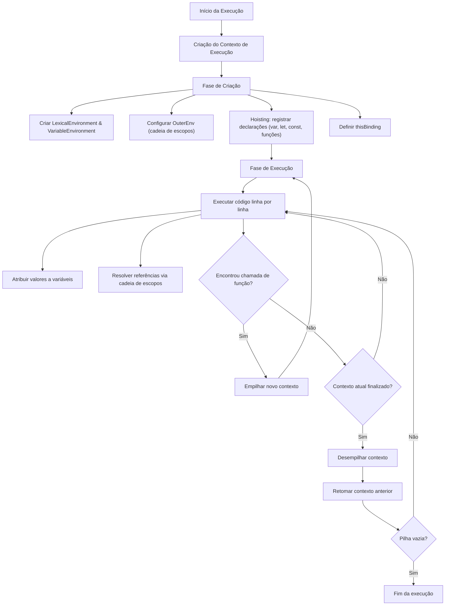

# Contexto de Execução
O **contexto de execução** é um conceito fundamental em JavaScript que ajuda a gerenciar a execução do código. Toda vez que você executa um código JavaScript (seja global, uma função, um módulo ou uma chamada `eval`), um novo contexto de execução é criado. Esse contexto rastreia o ambiente, as variáveis e o fluxo do código.
Os contextos de execução são gerenciados em uma **pilha** (a "pilha de execução" ou "call stack") que segue o princípio **LIFO (Last In, First Out - Último a Entrar, Primeiro a Sair)**. O contexto no topo da pilha é o que está sendo executado no momento. Quando termina, ele é removido da pilha, e o contexto anterior retoma a execução.
## Registros de Ambiente (Environment Records)
Um **Registro de Ambiente** é uma estrutura de dados interna usada pelo motor JavaScript para gerenciar o mapeamento entre identificadores (como nomes de variáveis, nomes de funções, etc.) e seus valores durante a execução do código.
Pontos-chave sobre os Registros de Ambiente:
- Eles rastreiam quais nomes (identificadores) estão disponíveis em cada escopo e a que se referem.
- Cada bloco de código `{ ... }` tem seu próprio Registro de Ambiente que gerencia as declarações dentro dele.
### Hierarquia dos Registros de Ambiente (Modelo Orientado a Objetos)
Na especificação ECMAScript, os Registros de Ambiente são modelados como uma hierarquia de classes:
- **Environment Record** (classe base abstrata)
  - **Declarative Environment Record** (gerencia vinculações de `let`, `const`, classes, módulos)
    - **Function Environment Record** (para escopos de função)
    - **Module Environment Record** (para módulos)
  - **Object Environment Record** (usado para declarações globais `var` e de funções, e com a declaração `with`)
  - **Global Environment Record** (um registro composto para o escopo global)
## OuterEnv (A Referência ao Ambiente Externo)
Todo Registro de Ambiente tem um campo **`OuterEnv`**. Esse campo contém uma referência ao **ambiente pai (externo)**, formando uma cadeia de ambientes conhecida como **cadeia de escopos (scope chain)**.
### Como a Cadeia de Escopos Funciona
Quando o JavaScript precisa resolver um identificador (como um nome de variável), ele:
1. Procura no Registro de Ambiente atual.
2. Se não encontrado, segue a referência `OuterEnv` para o ambiente pai e verifica lá.
3. Isso continua até que o identificador seja encontrado ou até que o escopo global (onde `OuterEnv` é `null`) seja alcançado. Se o identificador não for encontrado no escopo global, ocorre um `ReferenceError`.
## Componentes do Contexto de Execução Global
O contexto de execução global tem vários componentes-chave:
### Estado de Avaliação de Código (Code Evaluation State)
Refere-se ao conjunto de informações que o motor JavaScript (como o V8) mantém para gerenciar o fluxo de avaliação do código. É crucial para:
- **Operações assíncronas**: Gerenciar `await` sem perder o contexto.
- **Depuração**: Pausar e retomar a execução em breakpoints.
- **Iteração**: Controlar geradores (usando `yield` e `next`).
### Realm (Domínio)
Um **Realm** é um ambiente isolado onde o código JavaScript é executado. Por exemplo, cada aba do navegador tem seu próprio Realm para evitar interferência entre abas. Antes da execução, todo pedaço de código JavaScript deve ser associado a um Realm. Conceitualmente, um Realm inclui:
- Um conjunto de **objetos intrínsecos** (objetos embutidos padrão).
- Um **objeto global**.
- Um **registro de ambiente global**.
#### Objetos Intrínsecos (Intrinsic Objects)
São objetos e funções embutidos padrão essenciais para a execução do código, como `Array`, `Function`, `Date`, `Math` e `SyntaxError`.
#### O Objeto Global (Global Object)
O objeto global é uma parte fundamental do Realm. Em diferentes ambientes:
- Nos navegadores: `window` (ou `self`, `frames`, `globalThis`).
- No Node.js: `global` (ou `globalThis`).
O objeto global tem três tipos de propriedades:
1. **Propriedades de Especificação**:
   - Expõem objetos intrínsecos via objeto global.
   - Exemplo: `window.Array` (navegador), `globalThis.Math` (Node.js).
2. **Propriedades do Host (Ambiente)**:
   - São propriedades específicas do ambiente.
   - Nos navegadores: `document`, `fetch`, `localStorage`.
   - No Node.js: `process`, `__dirname`.
3. **Propriedades Definidas pelo Usuário**:
   - Propriedades adicionadas pelos desenvolvedores ao objeto global, explicitamente:
     ```javascript
     window.nomeDoMeuApp = "Meu Aplicativo Incrível"; // Navegador
     globalThis.empresa = "ACME"; // Node.js
     ```
   - Ou implicitamente (declarando variáveis com `var` ou funções no escopo global):
     ```javascript
     var globalVar = 10; // Torna-se window.globalVar no navegador
     function cumprimentar() {} // Torna-se window.cumprimentar no navegador
     ```
#### Registro de Ambiente Global (Global Environment Record)
O Registro de Ambiente Global gerencia as vinculações (associações entre nomes e valores) para todas as declarações no escopo global. É um registro composto feito de duas partes:
1. **Registro de Ambiente Declarativo (Declarative Environment Record)**:
   - Gerencia declarações de `let`, `const`, `class` e módulos no escopo global.
   - Essas vinculações **não** são acessíveis como propriedades do objeto global (então você não pode fazer `window.minhaLet` para uma variável `let`).
   - Tem um campo `OuterEnv`, que é `null` (pois o escopo global não tem ambiente externo).
2. **Registro de Ambiente de Objeto (Object Environment Record)**:
   - Usa o objeto global (como `window`) como seu objeto base.
   - Gerencia:
     - Declarações `var` no escopo global.
     - Declarações de funções no escopo global.
     - Propriedades globais embutidas (como `Array`, `Math`).
   - Também tem um campo `OuterEnv` (definido como `null` para o escopo global).
   - Importante: O Registro de Ambiente de Objeto existe **apenas** no contexto global. Em outros contextos (como funções, blocos, módulos), apenas o Registro de Ambiente Declarativo é usado porque eles não interagem diretamente com o objeto global.
## Ambiente Léxico vs. Ambiente de Variáveis (Lexical Environment vs. Variable Environment)
Todo contexto de execução tem dois componentes relacionados ao ambiente:
### Ambiente Léxico (Lexical Environment)
- **O que aponta**: O Registro de Ambiente para o contexto atual.
  - No contexto global: Aponta para o Registro de Ambiente Global.
  - Em uma função: Aponta para o Registro de Ambiente da função.
- **O que armazena**:
  - Vinculações de `let` e `const`.
  - Vinculações de classes e módulos.
- **Comportamento**: Durante a fase de criação de um contexto de execução, variáveis declaradas com `let` e `const` estão na Zona Temporalmente Morta (Temporal Dead Zone - TDZ) — elas existem, mas não podem ser acessadas até serem inicializadas.
### Ambiente de Variáveis (Variable Environment)
- **O que aponta**: Inicialmente o mesmo que o Ambiente Léxico.
- **O que armazena**:
  - Declarações `var`.
  - Declarações de funções.
- **Comportamento**: Ao contrário do Ambiente Léxico, o Ambiente de Variáveis permanece **fixo** durante toda a execução do contexto. O Ambiente Léxico, no entanto, pode mudar (por exemplo, dentro de um bloco `catch` ou de um loop).
### Exemplo
```javascript
// Contexto global
var globalVar = "Sou um var"; // Armazenado no VariableEnvironment (parte Object do Global Environment Record)
let globalLet = "Sou um let"; // Armazenado no LexicalEnvironment (parte Declarative)
function minhaFuncao() {
  var funcVar = "Dentro da função (var)"; // Armazenado no VariableEnvironment da função
  let funcLet = "Dentro da função (let)"; // Armazenado no LexicalEnvironment da função
}
```
## Exemplo de Fluxo de Execução

```javascript
console.log("Início"); // (1)
function primeira() {
  console.log("Primeira função"); // (3)
}
function segunda() {
  primeira(); // (4)
  console.log("Segunda função"); // (5)
}
segunda(); // (2)
console.log("Fim"); // (6)
```
A pilha de execução ficaria assim:
1. Contexto global é criado e colocado na pilha.
2. `segunda()` é chamada: um contexto para `segunda` é criado e empilhado.
3. `primeira()` é chamada de dentro de `segunda`: um contexto para `primeira` é criado e empilhado.
4. `primeira` executa: registra "Primeira função", depois é removida da pilha.
5. `segunda` retoma: registra "Segunda função", depois é removida da pilha.
6. Contexto global retoma: registra "Fim", então a pilha está vazia.
---

## Fluxograma: Ciclo de Vida do Contexto de Execução


### Explicação do Fluxograma

#### 1. **Fase de Criação**  
Ocorre **antes da execução do código**. Preparação do ambiente onde:  
- **Hoisting**:  
  Declarações são registradas na memória:  
  - `var`: inicializadas como `undefined`  
  - `function`: totalmente disponíveis  
  - `let`/`const`: registradas mas não acessíveis (Temporal Dead Zone)  
  ```javascript
  console.log(a); // undefined (var)
  console.log(b); // ReferenceError (let)
  var a = 10;
  let b = 20;
  ```

- **Cadeia de Escopos**:  
  Configuração do `OuterEnv` que define hierarquia de escopos:  
  ```mermaid
  graph LR
    A[Escopo Atual] --> B[Escopo Pai]
    B --> C[Escopo Global]
    C --> D[null]
  ```

- **Definição do `this`**:  
  Valor de `this` é estabelecido:  
  - Global: `window` (navegador) ou `global` (Node.js)  
  - Função: depende do modo de chamada  

#### 2. **Fase de Execução**  
O código é **executado linha por linha**:  
- **Atribuição de Valores**:  
  Variáveis recebem valores reais:  
  ```javascript
  x = 10; // Atribuição ocorre aqui
  ```

- **Resolução de Variáveis**:  
  Busca na cadeia de escopos quando variável é referenciada:  
  ```javascript
  function externo() {
    let cor = "azul";
    function interno() {
      console.log(cor); // Busca em OuterEnv → 'azul'
    }
    interno();
  }
  ```

#### 3. **Chamadas de Função**  
Quando uma função é invocada:  
- **Novo Contexto Empilhado**:  
  Um novo contexto é criado e colocado no topo da pilha:  
  ```mermaid
  flowchart LR
    G[Global] --> F1[Função 1]
    F1 --> F2[Função 2]
  ```

- **Processo Recomeça**:  
  As fases de **Criação** e **Execução** se repetem para a nova função.  

#### 4. **Finalização**  
Quando a execução termina:  
- **Contexto Desempilhado**:  
  O contexto atual é removido da pilha:  
  ```mermaid
  flowchart LR
    F2[Função 2] -- Finaliza --> F1[Função 1]
  ```

- **Retorno ao Contexto Anterior**:  
  A execução retoma exatamente onde parou:  
  ```javascript
  function task1() {
    console.log("Início task1");
    task2(); // Contexto novo criado aqui
    console.log("Fim task1"); // Retoma aqui após task2
  }
  ```