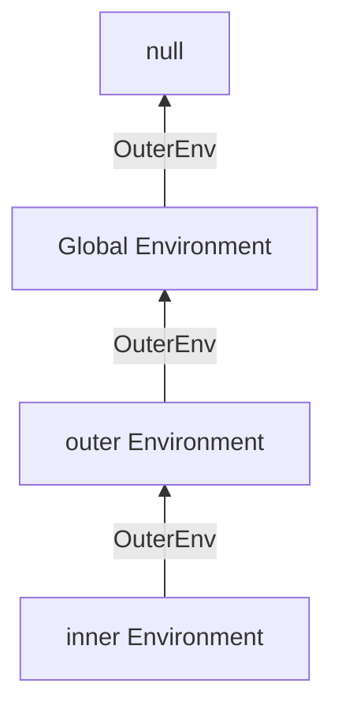
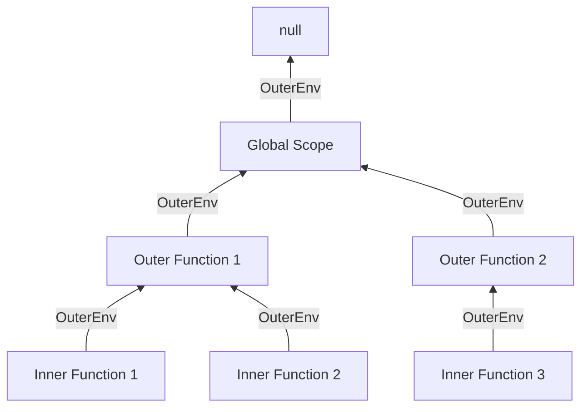

# Scope Chain

A **scope chain** (cadeia de escopo) é um mecanismo fundamental em JavaScript que determina como as variáveis e funções são acessadas em diferentes níveis de escopo. Ela é uma **estrutura hierárquica** que conecta todos os escopos aninhados, permitindo que funções internas acessem variáveis de funções externas e do escopo global.

#### Princípios-chave:
- **Escopo léxico**: O escopo é definido pela posição no código fonte
- **Encadeamento**: Escopos são ligados em uma cadeia hierárquica
- **Direção de busca**: Do escopo mais interno para o mais externo
- **Acesso somente ascendente**: Escopos internos podem acessar escopos externos, mas não o inverso

## Como funciona na prática

### Exemplo básico:
```javascript
// Escopo Global
const globalVar = "Global";

function outer() {
  // Escopo de outer()
  const outerVar = "Outer";
  
  function inner() {
    // Escopo de inner()
    const innerVar = "Inner";
    
    console.log(innerVar); // Acessa escopo local
    console.log(outerVar); // Acessa escopo pai
    console.log(globalVar); // Acessa escopo global
  }
  
  inner();
}

outer();
```

### Fluxo de busca na Scope Chain:
1. Quando `inner()` tenta acessar `outerVar`:
2. Busca no escopo local de `inner()` → não encontra
3. Sobe para o escopo pai (`outer()`) → encontra
4. Usa o valor "Outer"

## Como funciona internamente

### Estrutura subjacente:
- Cada função cria seu próprio **Environment Record** (registro de ambiente)
- Todo Environment Record tem uma referência `[[OuterEnv]]` para seu escopo pai
- A scope chain é formada por esta cadeia de referências

### Representação da Scope Chain:


### Detalhes técnicos:
1. **Criação do escopo**:
   - Quando uma função é declarada, ela "captura" a scope chain atual
   - Esta cadeia fica armazenada na propriedade interna `[[Scope]]`

2. **Execução**:
   - Quando a função é executada, um novo **execution context** é criado
   - Seu Environment Record é ligado ao `[[OuterEnv]]` do contexto pai

3. **Busca de variáveis**:
   - O motor JS percorre a cadeia até encontrar a variável
   - Se chegar ao escopo global sem encontrar → `ReferenceError`


## Escopo de Bloco

O **escopo de bloco** refere-se à visibilidade de uma variável limitada ao bloco (delimitado por chaves `{}`) onde foi declarada. Introduzido no ECMAScript 2015 (ES6) com as palavras-chave `let` e `const`, esse conceito permite um controle mais granular sobre o ciclo de vida das variáveis.

### Características
- **Aplica-se a**: `let`, `const`
- **Não se aplica a**: `var` (possui escopo de função ou global)
- **Blocos comuns**: `if`, `for`, `while`, `switch`, blocos vazios `{}`

### Exemplo básico
```javascript
// Exemplo com var (não tem escopo de bloco)
if (true) {
  var x = 10;
}
console.log(x); // 10 (vazou para fora do bloco)

// Exemplo com let (tem escopo de bloco)
if (true) {
  let y = 20;
}
console.log(y); // ReferenceError: y is not defined
```

### Exemplo em Loop
```javascript
// Problema com var (todas as iterações compartilham a mesma variável)
for (var i = 0; i < 3; i++) {
  setTimeout(() => console.log(i), 100); // 3, 3, 3
}

// Solução com let (cada iteração tem seu próprio escopo)
for (let j = 0; j < 3; j++) {
  setTimeout(() => console.log(j), 100); // 0, 1, 2
}
```

### Blocos independentes
Você pode criar blocos arbitrários para isolar variáveis:
```javascript
// Bloco 1
{
  const temp = "Temporário 1";
  console.log(temp); // "Temporário 1"
}

// Bloco 2
{
  const temp = "Temporário 2";
  console.log(temp); // "Temporário 2"
}

console.log(temp); // ReferenceError: temp is not defined
```

## Shadowing (sombreamento)

### Definição
**Shadowing** ocorre quando uma variável declarada em um escopo interno tem o mesmo nome de uma variável em um escopo externo, efetivamente "escondendo" a variável externa dentro do escopo interno.

### Exemplo simples
```javascript
const mensagem = "Global";

function teste() {
  const mensagem = "Local"; // Shadowing da variável global
  console.log(mensagem); // "Local"
}

teste();
console.log(mensagem); // "Global"
```

### Funcionamento
- A variável no escopo mais interno tem prioridade
- A variável externa não é alterada, apenas fica inacessível no escopo interno
- É permitido, mas pode causar confusão se usado indiscriminadamente

### Shadowing em diferentes contextos
```javascript
let valor = "nível 0";

if (true) {
  let valor = "nível 1"; // Shadowing do escopo superior
  console.log(valor); // "nível 1"
  
  if (true) {
    let valor = "nível 2"; // Shadowing novamente
    console.log(valor); // "nível 2"
  }
  
  console.log(valor); // "nível 1"
}

console.log(valor); // "nível 0"
```

### Shadowing com parâmetros de função
```javascript
const valor = 100;

function processa(valor) { // Shadowing do global
  console.log(valor * 2); // Usa o parâmetro
}

processa(5); // 10
console.log(valor); // 100 (global inalterada)
```

### Armadilhas e cuidados

#### 1. Shadowing acidental
```javascript
const usuario = { id: 1, nome: "João" };

function atualizaUsuario() {
  // Shadowing não intencional (esqueceu que já existe uma variável usuario)
  const usuario = { id: 2, nome: "Maria" }; // Criou nova variável ao invés de atualizar
  // ... código que usa usuario local
}

atualizaUsuario();
console.log(usuario); // { id: 1, nome: "João" } (não atualizou o global)
```

#### 2. Impossibilidade de redeclaração no mesmo escopo
```javascript
let contador = 0;

// Em outro bloco, shadowing é permitido
if (true) {
  let contador = 1; // OK
}

// No mesmo escopo, erro de sintaxe
let contador = 2; // SyntaxError: Identifier 'contador' has already been declared
```

#### 3. Shadowing de Objetos Globais (Perigoso!)
```javascript
// Exemplo arriscado
function calculaCircunferencia(raio) {
  const Math = { PI: 3.14 }; // Shadowing do objeto Math global
  return 2 * Math.PI * raio;
}

console.log(calculaCircunferencia(1)); // 6.28
console.log(Math.PI); // 3.141592653589793 (global ainda intacta)
```

## Direção da Scope Chain 

### A Direção correta: De baixo para cima

#### Princípio Fundamental:
- **Busca ascendente**: Quando uma variável é referenciada, o JavaScript sempre começa a busca **no escopo atual** e sobe para os escopos pais até encontrar a variável
- **Não existe busca descendente**: Escopos internos não podem ser acessados por escopos externos

#### Por que não funciona de cima para baixo?
1. **Encapsulamento**: Escopos internos são "caixas pretas" para escopos externos
2. **Privacidade**: Variáveis locais não devem ser expostas a escopos superiores
3. **Eficiência**: Buscar do escopo mais específico para o mais geral é mais rápido

### Funcionamento prático

Exemplo de Código:
```javascript
// Global Environment
const globalVar = "Global";

function outer() { // outer Environment
  const outerVar = "Outer";
  
  function inner() { // inner Environment
    const innerVar = "Inner";
    
    console.log(innerVar); // 1. Encontra no escopo local
    console.log(outerVar); // 2. Busca no escopo pai (outer)
    console.log(globalVar); // 3. Busca no escopo avô (global)
    console.log(inexistente); // 4. Erro: não encontrado em nenhum escopo
  }
  
  inner();
  
  // Tentativa inválida de acesso descendente:
  console.log(innerVar); // ReferenceError!
}

outer();
```

#### Passo a passo da busca por `outerVar`:
1. O motor JavaScript começa no **escopo de `inner()`**
2. Verifica se `outerVar` existe no Environment Record local → ❌ não encontrado
3. Segue a referência `[[OuterEnv]]` para o escopo de `outer()`
4. Encontra `outerVar` no Environment Record de `outer()` → ✅
5. Usa o valor "Outer"

### Consequências importantes

#### 1. Shadowing funciona graças a esta direção:
```javascript
const x = "Global";

function exemplo() {
  const x = "Local"; // Shadowing da variável global
  
  function interna() {
    console.log(x); // Busca: interna ❌ → exemplo ✅ ("Local")
  }
  
  interna();
}

exemplo();
```

#### 2. Closures são possíveis:
```javascript
function criarContador() {
  let count = 0; // Pertence ao escopo de criarContador
  
  return function() {
    count++; // Acessa count via [[OuterEnv]] (escopo pai)
    return count;
  };
}

const contador = criarContador();
console.log(contador()); // 1
console.log(contador()); // 2
```

#### 3. Erros comuns explicados:
```javascript
function problema() {
  for (var i = 0; i < 3; i++) {
    setTimeout(function() {
      console.log(i); // Sempre 3! Por quê?
    }, 100);
  }
}

problema();
```

**Explicação**: Todas as callbacks compartilham o **mesmo `i`** (no escopo de `problema`). A busca ocorre na direção:
1. Escopo da callback → não encontra `i`
2. Sobe para escopo de `problema` → encontra `i` (já incrementado para 3)

**Solução com escopo de bloco**:
```javascript
function solucao() {
  for (let i = 0; i < 3; i++) { // let cria novo escopo por iteração
    setTimeout(function() {
      console.log(i); // 0, 1, 2
    }, 100);
  }
}
```

### Resumo Técnico

| Característica         | Explicação                                                                 |
|------------------------|---------------------------------------------------------------------------|
| **Direção da busca**   | Sempre do escopo atual para os pais (interno → externo)                   |
| **[[OuterEnv]]**       | Referência ao escopo pai (nunca aos filhos)                               |
| **Término da busca**   | Quando encontra a variável ou chega ao escopo global ([[OuterEnv]] = null) |
| **Erro**               | ReferenceError se não encontrar em nenhum escopo da cadeia                |
| **Impacto no desempenho** | Escopos mais profundos têm tempos de busca ligeiramente maiores          |

## Casos especiais e armadilhas

### 1. Cadeias dinâmicas vs léxicas
```javascript
const x = "global";

function dynamicLookup() {
  console.log(x);
}

function outer() {
  const x = "local";
  dynamicLookup(); // Sempre imprime "global"!
}

outer();
```

**Explicação:**  
A scope chain é definida **lexicamente** (pela posição no código), não dinamicamente (pelo local de chamada).

### 2. Loops com var vs let
```javascript
// Com var (problema comum)
for (var i = 0; i < 3; i++) {
  setTimeout(() => console.log(i), 100); // 3, 3, 3
}

// Com let (solução)
for (let j = 0; j < 3; j++) {
  setTimeout(() => console.log(j), 100); // 0, 1, 2
}
```

**Por quê?**  
`let` cria um novo escopo para cada iteração, enquanto `var` usa o mesmo escopo para todas.

### 3. Vazamento para escopo global
```javascript
function leakyFunction() {
  undeclaredVar = "Vazei!"; // Sem var/let/const
}

leakyFunction();
console.log(undeclaredVar); // "Vazei!" (agora é global)
```

**Solução:** Sempre declarar variáveis com `const`, `let` ou `var`.

## Diagrama final da Scope Chain:


## Referências Utilizadas

- [ECMAScript® 2024 Language Specification - Environment Records](https://tc39.es/ecma262/multipage/executable-code-and-execution-contexts.html#sec-environment-records)  
- [MDN Web Docs - Escopo (Scope)](https://developer.mozilla.org/en-US/docs/Glossary/Scope)  
- [JavaScript Info - Escopo de Bloco e Escopo Léxico](https://javascript.info/closure)  
- [\#08 - Aprenda de vez o que é Scope Chain](https://www.youtube.com/watch?v=giUXxCHDiww)  
